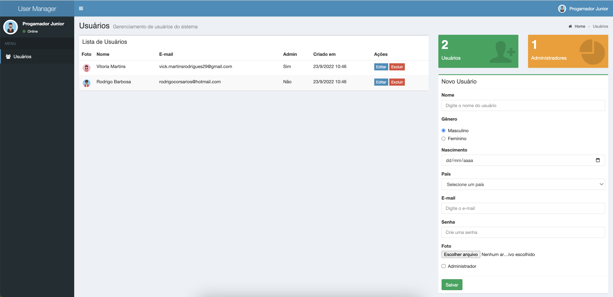

<h1
  align="center"
  style="font-size: 130px; color: #3c8dbc; font-weight: 700"
>
  User Manager
</h1>

<h1 align="center">
      
</h1>

  
  

  <a href="#-tecnologias">Tecnologias</a>&nbsp;&nbsp;&nbsp;|&nbsp;&nbsp;&nbsp;
  <a href="#-projeto">Projeto</a>

## 🚀 Tecnologias

Esse projeto foi desenvolvido com as seguintes tecnologias:

- [JavaScript](https://developer.mozilla.org/pt-BR/docs/Web/JavaScript)
- [HTML](https://www.w3schools.com/html/)

## 💻 Projeto

USER MANAGER 💚

## Autor

<a href="http://linkedin.com/in/vitória-martins-03631b191">
 
    <b>Vitória Martins</b>
 
</a>
🚀

  
  

<Feito com 💚 />